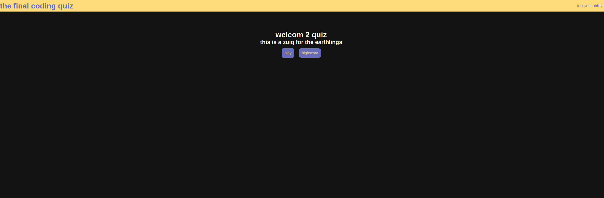

# Coding Quiz
The quiz to end them all

## About the project
This is a coding quiz for my module 4 challenge activity in the coding bootcamp at the University of Minnesota

## Project Criteria

- When the user clicks the "Start" button, the quiz starts.
- The user is then presented with a question.
- When the user answers the question, they are then presented with another. 
- If the user get a question wrong, time is subracted from the clock.
- Once the quiz ends, then the game ends.
- If the user answers the quiz in the allocated time, they are presented with a screen to input their name, and save their score.

## Screenshot!

## Deployment of project
Feel free to access and test the site [here!](https://fixedotter.github.io/codingQuiz/)